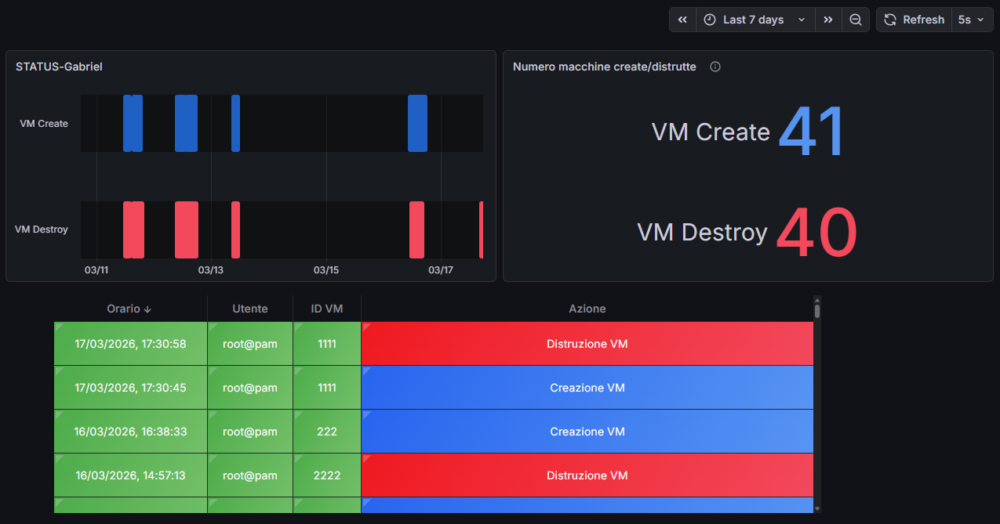
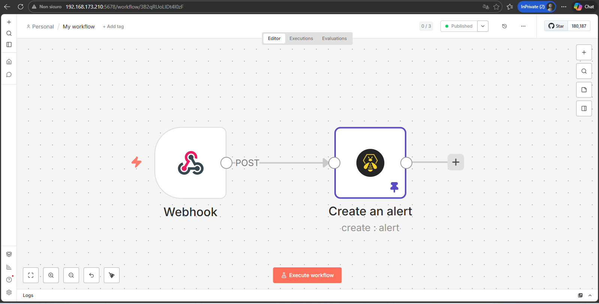
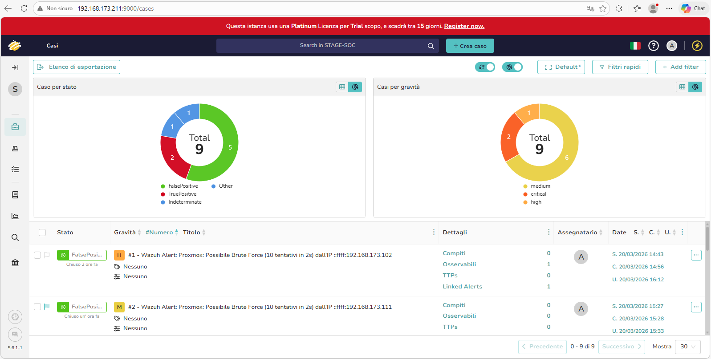
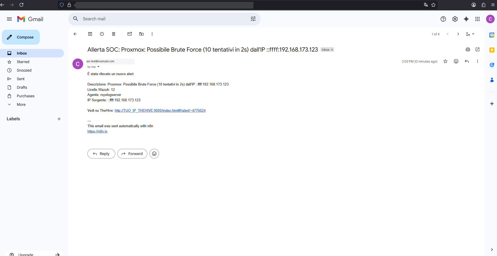

# 🛡️ Enterprise SOC Lab — SIEM + SOAR + AI

> Laboratorio enterprise completo di Security Operations Center con detection in tempo reale, risposta automatizzata agli incidenti (SOAR) e analisi AI locale delle vulnerabilità.

[](https://wazuh.com)
[](https://n8n.io)
[](https://strangebee.com)
[](https://ollama.com)
[](https://proxmox.com)
[](./LICENSE)

---

## 📖 Overview

Questo repository raccoglie regole, decoder, workflow, script e documentazione di un progetto di laboratorio realizzato durante un **Master in Cyber Security** (LabForWeb — Regione Lazio, 2025–2026), con stage presso un'azienda di servizi a Roma.

L'obiettivo era costruire **da zero** un'infrastruttura IT enterprise completa con SIEM/SOC funzionante, automazione della risposta agli incidenti (SOAR) e integrazione di un LLM locale per l'analisi automatizzata delle vulnerabilità — il tutto su hardware modesto e con software open source.

> **Nota privacy:** tutti i nomi utente, gli indirizzi email e i riferimenti aziendali sono stati anonimizzati. Gli IP sono in subnet privata RFC1918.

---

## 📸 Anteprima

| Dashboard SOC (Grafana) | Workflow SOAR (n8n) |
|:---:|:---:|
|  |  |
| **Casi su TheHive** | **Notifica automatica** |
|  |  |

---

## 🏗️ Architettura

```
┌────────────────────────────────────────────────────────────────────┐
│                       PROXMOX VE (Hypervisor)                        │
│                   192.168.173.0/24 — bridge vmbr1                    │
└────────────────────────────────────────────────────────────────────┘
        │                                                       │
        ▼                                                       ▼
┌──────────────────┐                                   ┌──────────────────┐
│ DOMINIO AD       │                                   │ SIEM / SOC ZONE  │
│ ───────────────  │                                   │ ───────────────  │
│ DC01 (.202)      │ ──── eventi Windows ─────────►    │ Wazuh Manager    │
│ DC02 (.203)      │      (Wazuh Agent, TCP 1514)      │ VM 107 (.206)    │
│ FILE01 (.204)    │ ──── FIM whodata ────────────►    │ + OpenSearch     │
│ SOC-01/02/03     │                                   │                  │
│ (Win 11)         │                                   │ Grafana → Kali   │
└──────────────────┘                                   │ (dashboard SOC)  │
        ▲                                               └────────┬─────────┘
        │ (replica DC)                                           │ webhook
        │                                                        ▼
┌──────────────────┐                                   ┌──────────────────┐
│ Proxmox host     │ ── syslog UDP:514 ──┐             │ AUTOMAZIONE SOAR  │
│ (.100)           │                     │             │ ───────────────   │
│ + Wazuh agent    │                     ▼             │ n8n      CT 102   │
└──────────────────┘            ┌──────────────────┐   │ TheHive 5 CT 104  │
                                │ Rsyslog  VM 108  │──►│ Ollama   VM 108   │
                                │ + Prometheus     │   │      │            │
                                │ + Ollama (.208)  │   │      ▼            │
                                └──────────────────┘   │ Email + Telegram  │
                                                       └──────────────────┘
```

> **Nota sui nodi:** la VM 108 (`192.168.173.208`, Debian) ospita tre servizi:
> il collettore **Rsyslog**, **Prometheus** (metriche hardware) e **Ollama** (LLM locale).
> **Grafana** gira sulla macchina **Kali** (IP da DHCP) e funge da dashboard SOC.

**Stack tecnologico**

- **Hypervisor**: Proxmox VE (KVM + LXC)
- **Identity**: Active Directory (Windows Server 2022) — dual-DC con replica
- **SIEM**: Wazuh 4.14.3 + OpenSearch
- **Dashboard**: Grafana 12.4.1 (su Kali) + plugin OpenSearch + Prometheus / Node Exporter
- **SOAR**: n8n (workflow automation) + TheHive 5 (incident response)
- **AI**: Ollama + Llama 3 (LLM locale per analisi CVE)
- **Notifiche**: SMTP + Telegram Bot API

La tabella IP completa e le pipeline dei log sono documentate in [`docs/architecture.md`](docs/architecture.md).

---

## 🎯 Cosa contiene questo repo

### 📁 [`wazuh-rules/`](wazuh-rules/)

Le **12 regole di correlazione personalizzate**. Nel laboratorio erano organizzate in 5 file XML; in questo repo sono state consolidate e rinominate in 3 file per ambito:

- [`proxmox_vm_monitoring.xml`](wazuh-rules/proxmox_vm_monitoring.xml) — creazione/distruzione VM Proxmox (rule 100011–100012)
- [`proxmox_bruteforce.xml`](wazuh-rules/proxmox_bruteforce.xml) — brute force su login Proxmox, MITRE ATT&CK T1110 (rule 100015, 100501)
- [`ransomware_behavioral.xml`](wazuh-rules/ransomware_behavioral.xml) — CRUD su File Server con identità AD e detection ransomware comportamentale (rule 100030, 100032, 100041–100046)

### 📁 [`wazuh-decoders/`](wazuh-decoders/)

I **6 decoder XML personalizzati** per i log Proxmox `pvedaemon` (formato non standard con IPv4-mapped IPv6). Vedi [`proxmox_decoders.xml`](wazuh-decoders/proxmox_decoders.xml).

### 📁 [`n8n-workflows/`](n8n-workflows/)

Il workflow SOAR completo a **7 nodi** con routing intelligente. Un nodo **Switch** divide il flusso in due rami in base al gruppo dell'alert: il **ramo attacchi** (alert senza gruppo `vulnerability-detector` → TheHive + Email + Telegram) e il **ramo vulnerabilità** (alert con gruppo `vulnerability-detector` e level ≥ 10 → analisi AI con Ollama → Telegram). File importabile: [`wazuh-soar-workflow.json`](n8n-workflows/wazuh-soar-workflow.json).

### 📁 [`scripts/`](scripts/)

- [`custom-n8n.py`](scripts/custom-n8n.py) — script Python di integrazione Wazuh → n8n
- [`test-bruteforce.sh`](scripts/test-bruteforce.sh) — simulazione brute force su Proxmox
- [`test-ransomware.ps1`](scripts/test-ransomware.ps1) — simulazione ransomware su File Server

### 📁 [`grafana/`](grafana/)

Query PromQL per i pannelli hardware Proxmox (CPU, RAM, disco, uptime) e query Lucene per i pannelli SOC su OpenSearch. Vedi [`queries.md`](grafana/queries.md).

### 📁 [`docs/`](docs/)

- [`architecture.md`](docs/architecture.md) — schema completo della rete, tabella IP e pipeline dei log
- [`troubleshooting.md`](docs/troubleshooting.md) — problemi incontrati e soluzioni (cqlsh Ubuntu 25.04, Telegram parse mode, FIM whodata, ordine di caricamento decoder, ecc.)
- [`lessons-learned.md`](docs/lessons-learned.md) — 12 lezioni dal campo

### 📁 [`screenshots/`](screenshots/)

Le immagini dell'infrastruttura operativa (Proxmox, Wazuh, Grafana, n8n, TheHive). Email e identificativi sensibili sono oscurati.

---

## 🚀 Highlights del progetto

### 1. SIEM con detection ransomware comportamentale

Le regole 100030 / 100032 / 100044 / 100045 / 100046 implementano una *detection chain* per ransomware che non si basa su firme ma sul **comportamento**: cancellazioni massive, creazioni rapide, rinomina con cambio estensione. Funziona anche contro varianti zero-day.

### 2. SOAR end-to-end in &lt;1 secondo

Dal momento in cui Wazuh rileva un brute force Proxmox al momento in cui l'analista SOC riceve la notifica con link diretto al caso TheHive passa **meno di 1 secondo** (0.74s misurato da n8n). Tutto il flusso è automatizzato.

### 3. AI locale per l'analisi CVE (privacy-first)

Un nodo Ollama con Llama 3 riceve gli alert di vulnerabilità, genera un'analisi strutturata (rischio, comando di remediation, priorità) e la invia su Telegram. **Tutto in locale**, nessun dato esce dalla rete aziendale.

### 4. FIM whodata con identità AD reale

Il File Integrity Monitoring traccia non solo il file modificato ma anche **l'utente AD** che ha eseguito l'operazione, sfruttando l'integrazione con Windows Security Audit (SACL + Event ID 4663).

---

## 📊 Numeri del progetto

| Metrica | Valore |
|---|---|
| Nodi virtualizzati | 11 (VM + LXC) |
| Agenti Wazuh attivi | 5 |
| Regole di correlazione custom | 12 |
| Decoder Wazuh personalizzati | 6 |
| Nodi workflow n8n | 7 |
| Pannelli dashboard Grafana | 18 |
| Test end-to-end superati | 30+ |
| Tempo di risposta SOAR | &lt;1s |

---

## 🛠️ Come usare questo materiale

Questo repo **non** è un installer o un playbook automatizzato — è un portfolio tecnico che mostra le scelte progettuali, il codice e le configurazioni reali di un laboratorio funzionante. Se vuoi replicare l'infrastruttura:

1. Leggi [`docs/architecture.md`](docs/architecture.md) per capire come si parlano i componenti
2. Adatta le regole Wazuh in [`wazuh-rules/`](wazuh-rules/) ai tuoi path e nomi agente
3. Importa il workflow n8n da [`n8n-workflows/wazuh-soar-workflow.json`](n8n-workflows/wazuh-soar-workflow.json) e ricrea le credenziali (TheHive API key, bot Telegram, SMTP)
4. Adatta le query PromQL/Lucene in [`grafana/`](grafana/) ai tuoi datasource

---

## 📚 Riferimenti

- **Wazuh Documentation**: <https://documentation.wazuh.com>
- **n8n Documentation**: <https://docs.n8n.io>
- **TheHive Documentation**: <https://docs.strangebee.com>
- **MITRE ATT&CK**: <https://attack.mitre.org>

---

## 📝 Licenza e disclaimer

- Codice e configurazioni rilasciati sotto licenza MIT (vedi [`LICENSE`](LICENSE)).
- Questo repo è materiale **didattico / portfolio**: le configurazioni adatte al laboratorio (es. `network.host: 0.0.0.0` su OpenSearch, `OLLAMA_HOST=0.0.0.0`) vanno irrobustite per un uso in produzione.
- Tutti i riferimenti aziendali sono stati anonimizzati nel rispetto degli accordi di riservatezza.

---

## 👤 Autore

Progetto realizzato nell'ambito del Master in Cyber Security — LabForWeb / Regione Lazio (2025–2026).

🔗 **LinkedIn**: [linkedin.com/in/d-gabriel-stanciu](https://linkedin.com/in/d-gabriel-stanciu)

---

⭐ Se questo materiale ti è stato utile, lascia una stella al repository.
